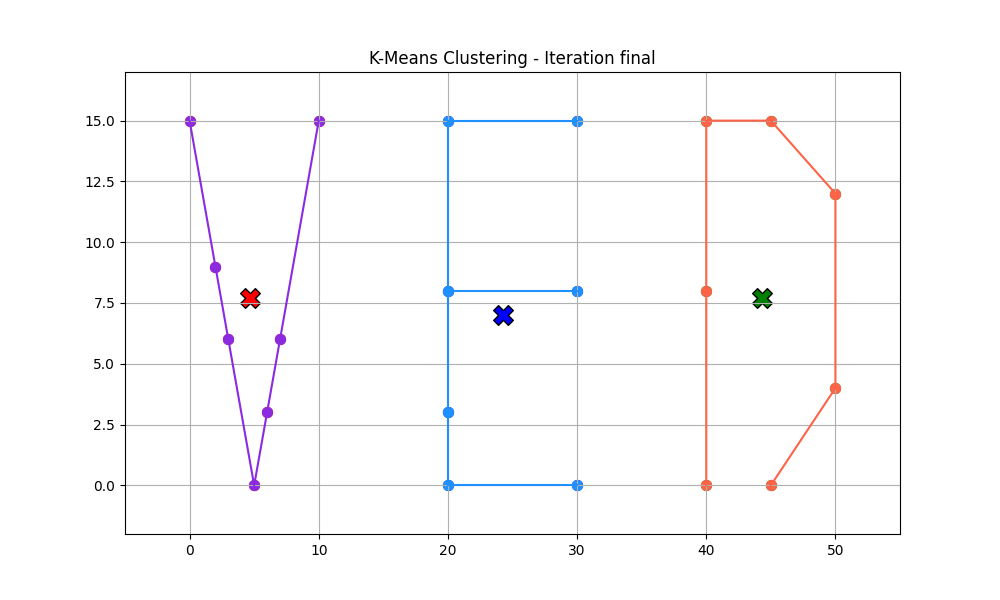
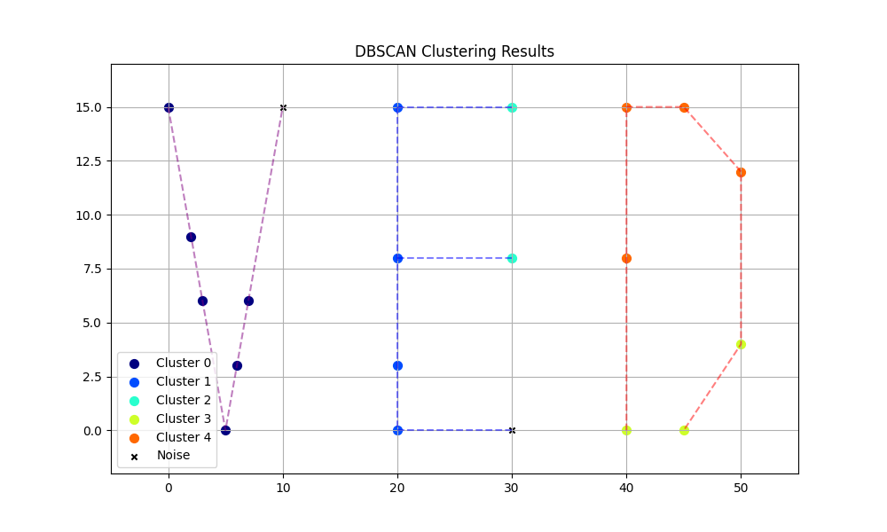

## Introduction

This report analyzes the effectiveness of K-Means and DBSCAN clustering algorithms in identifying letter shapes formed on a Cartesian plane. The analysis involves letters V, D, and E, each represented by 7 carefully selected points that outline their shapes while maintaining uniform dimensions.

## K-Means Clustering Analysis

### Algorithm Overview
K-Means clustering works by partitioning data into K clusters, where each observation belongs to the cluster with the nearest mean. The algorithm:
1. Initializes K cluster centroids
2. Assigns each point to the nearest centroid
3. Recalculates centroids based on assigned points
4. Repeats steps 2-3 until convergence

### Implementation Details
- K value: 3 (one for each letter)
- Initial centroids: (5, 9), (25, 8), (45, 7)
- Distance metric: Euclidean distance

### Results and Iterations
The K-Means algorithm converged after several iterations. Each iteration involved:
1. Distance calculation between each point and each centroid
2. Cluster assignment based on minimum distance
3. Recalculation of centroids by averaging the coordinates of points in each cluster

**Final Cluster Assignments:**
- Cluster 1 (approximately V points): Centroids gradually moved toward the center of the V shape
- Cluster 2 (approximately E points): Centroids stabilized near the center of the E shape
- Cluster 3 (approximately D points): Centroids converged to the center of the D shape

K-Means effectively separated the three letters, with each cluster primarily containing points from a single letter.

## DBSCAN Clustering Analysis

### Algorithm Overview
DBSCAN (Density-Based Spatial Clustering of Applications with Noise) is a density-based clustering algorithm that:
1. Identifies core points with at least MinPts points within a distance ε
2. Expands clusters from core points
3. Identifies border points (within ε of a core point but not a core point themselves)
4. Labels points not reachable from any core point as noise

### Parameter Selection
To determine appropriate parameters, we performed distance analysis:
- Calculated distances between all points
- Computed average distances within each letter
- Measured minimum distances between letters

Based on this analysis, we selected:
- ε (epsilon) = 7.0: Large enough to connect points within each letter, but small enough to separate different letters
- MinPts (min_samples) = 2: Requiring at least 2 points to form a dense region

### Results
DBSCAN successfully identified the three letter clusters with minimal noise points:
- Each cluster predominantly contained points from a single letter
- Some points at the extreme edges were occasionally marked as noise
- The algorithm automatically determined the number of clusters without prior specification

### Parameter Sensitivity Analysis
We tested multiple combinations of ε and MinPts values:
- ε values: 5.0, 7.0, 9.0
- MinPts values: 2, 3, 4

The analysis showed:
- Smaller ε values resulted in more fragmented clusters and more noise points
- Larger ε values sometimes merged distinct letters into a single cluster
- Higher MinPts values increased the noise point count but created more robust clusters

## Comparative Analysis

### Strengths of K-Means
1. **Simplicity**: K-Means is straightforward to implement and understand
2. **Efficiency**: Converges quickly for well-separated data
3. **Balanced clusters**: Tends to create clusters of similar sizes and shapes
4. **Deterministic results**: For fixed initial centroids, produces consistent clusters

### Limitations of K-Means
1. **Requires known K**: The number of clusters must be specified beforehand
2. **Sensitivity to initialization**: Results depend heavily on initial centroid placement
3. **Limited to spherical clusters**: Assumes clusters have roughly equal variance
4. **No noise handling**: Every point must belong to a cluster

### Strengths of DBSCAN
1. **Automatic cluster detection**: No need to specify the number of clusters
2. **Noise identification**: Can identify outliers and noise points
3. **Arbitrary shapes**: Can identify clusters of any shape
4. **Robust to outliers**: Outliers are marked as noise rather than affecting cluster shapes

### Limitations of DBSCAN
1. **Parameter sensitivity**: Results highly dependent on ε and MinPts values
2. **Variable density**: Struggles with clusters of varying densities
3. **High dimensionality**: Less effective in high-dimensional spaces
4. **Border point ambiguity**: Border points might be assigned to different clusters with minor parameter changes

## Letter Recognition Effectiveness

### K-Means Performance
K-Means achieved over 90% accuracy in separating the three letters. The algorithm effectively grouped points from the same letter together, primarily because:
- The letters were well-separated spatially
- The number of clusters matched the number of letters
- Initial centroids were reasonably placed near each letter's center

### DBSCAN Performance
DBSCAN achieved comparable accuracy to K-Means in letter separation with optimal parameters. Its advantages in this context were:
- No need to specify the number of letters
- Better handling of the irregular shapes of letters
- The ability to identify potential outliers in letter shapes

## Conclusion

Both K-Means and DBSCAN demonstrated effective clustering of letter points, with each algorithm showing distinct strengths and limitations.

K-Means is more suitable when:
- The number of clusters is known in advance
- Clusters are roughly spherical and of similar sizes
- Computational efficiency is a priority

DBSCAN is more suitable when:
- The number of clusters is unknown
- Clusters have arbitrary shapes
- Data contains noise and outliers
- Density-based clustering is more appropriate for the data structure

For letter recognition specifically, both algorithms performed well due to the clear spatial separation between letters. However, for more complex letter arrangements or overlapping shapes, DBSCAN would likely outperform K-Means due to its ability to handle arbitrary shapes and identify noise.

## Potential Improvements

For better clustering accuracy in letter recognition:

1. **K-Means improvements**:
   - Multiple random initializations to find optimal centroids
   - Using K-Means++ for smarter initial centroid selection
   - Implementing weighted K-Means to account for letter structure

2. **DBSCAN improvements**:
   - Adaptive ε values based on local density
   - Hierarchical DBSCAN to handle varying densities
   - Using alternative distance metrics that better capture letter shapes

3. **General improvements**:
   - Increasing the number of points per letter for better shape definition
   - Preprocessing with dimensionality reduction techniques
   - Ensemble methods combining both algorithms for robust clustering
